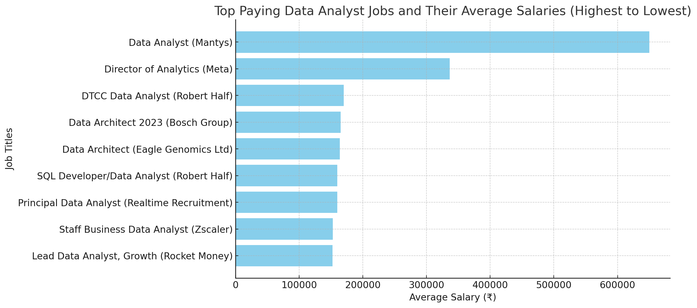
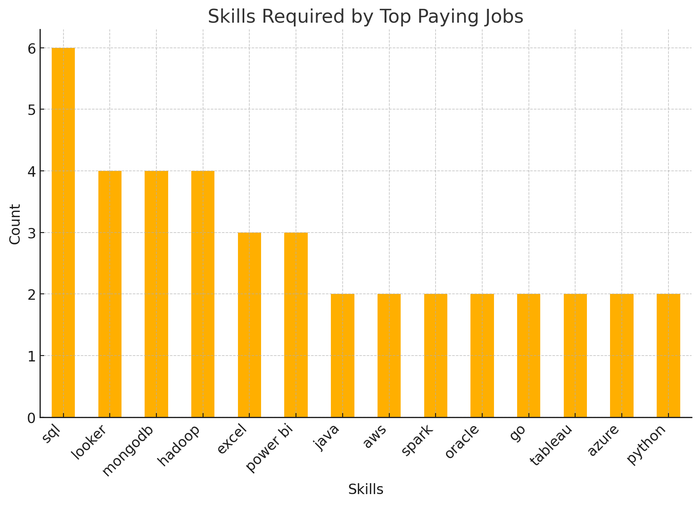

# Top Paying Jobs and Most Optimal Skills For Data Analysts In Canada and India (Or Remote)

## Introduction
The main objective of this project is to guide and inform aspiring data analysts, including myself, who want to work in Canada or India, on the job titles available as well as the corresponding companies and top salaries offered for those roles.

From there, we can move forward to understand the specific skills that are required and in demand for those jobs in data analyst and business analyst roles, such as SQL, Power BI, Python, Azure, AWS and more. 

Furthermore, we aim to explore which of these skills may result in higher average salaries and, given the salary, which skills are most optimal to learn in order to be successful as a data or business analyst. 

## Background

In these queries, Canada, India and remote jobs are all considered. Additionally, since we want to narrow our search to jobs without the need for a master's degree, we also filter the job postings that don't mention a degree requirement.

Since I am Indian, and I study in Canada, these filters are for the purpose of understanding the dynamics of the job market according to my search parameters. I hope that these insights can help others in a similar position.

SQL queries: [project_sql](/project_sql/)

## Questions Answered
1. What are the top paying jobs for Data Analysts in Canada/India?
2. What skills are required for these top paying jobs?
3. Which skills are most in demand for the role of Data Analysts in Canada/India
4. Which skills pay the most for these roles?
5. What are the most optimal skills to learn for Data Analysts in Canada/India based on salary and demand?

## Tools
- **SQL** - The dominant tool I used to clean, sort, reference, analyze and extract critical information from the database
- **PostgreSQL** - The database management system of choice to process the large dataset
- **Power BI** - The visualization software I used
- **Git & GitHub** - To manage my project and repository
- **Visual Studio Code** - The efficient and user-friendly editor I used

## Analysis
Detail the methods and procedures used in the project. Explain the data analysis process, algorithms implemented, and any experiments conducted.

### 1. What are the top paying jobs for Data Analysts in Canada/India?
```sql
SELECT 
    job_id,
    company_dim.name as "Company Name",
    job_title_short,
    job_title, 
    job_location,
    job_no_degree_mention,
    job_work_from_home,
    salary_year_avg
FROM
    job_postings_fact
LEFT JOIN company_dim ON job_postings_fact.company_id = company_dim.company_id
WHERE
    job_title_short IN('Data Analyst') AND
    salary_year_avg IS NOT NULL AND
    (job_country = 'Canada'
    OR job_country = 'India' OR job_work_from_home = TRUE) AND
    job_no_degree_mention = TRUE
ORDER BY
    salary_year_avg DESC
LIMIT 10;
```
### Insights
- **Wide Salary Range**: The difference in Salary shown by the top paying job and the second and third highlights the potential in data analyst roles at different companies. 
- **Remote Job Trends**: Out of these job postings, all are Work From Home except 2 (Bosch Group and Eagle Gernomics). This highlights the flexibility offered by data analyst roles
- **Job Title Diversity**: Ranging from working as Director, developer, data architect or in specific areas of the company such as growth and staff, Data analysis can be applied in many different areas and for different purposes. This highlights the wide use of data in company operations.  

*Top Paying Data Analyst Jobs By Average Salary*

### 2. What skills are required for these top paying jobs?
```sql
WITH top_paying_jobs AS(SELECT 
    job_id,
    company_dim.name as "Company Name",
    job_title_short,
    job_title, 
    salary_year_avg
FROM
    job_postings_fact
LEFT JOIN company_dim ON job_postings_fact.company_id = company_dim.company_id
WHERE
    job_title_short IN('Data Analyst') AND
    salary_year_avg IS NOT NULL AND
    (job_country = 'Canada'
    OR job_country = 'India' OR job_work_from_home = TRUE) AND
    job_no_degree_mention = TRUE
ORDER BY
    salary_year_avg DESC
LIMIT 10)

SELECT 
    top_paying_jobs.*,skills_dim.skills
FROM 
    top_paying_jobs
INNER JOIN skills_job_dim ON top_paying_jobs.job_id = skills_job_dim.job_id
INNER JOIN skills_dim ON skills_job_dim.skill_id = skills_dim.skill_id
ORDER BY 
    salary_year_avg DESC;

/* INNER JOIN is used instead of LEFT JOIN because 
 some job_ids are not associated with any skill */ 
```
### Insights
- **SQL** Leads the demand count as the top skill required by the job titles explored in the previous question
- Specialized tools such as Looker, Mongodb and Hadoop come second
- Excel and Power BI come third, showing general demand for these foundational skills  


### 3. Which skills are most in demand for the role of Data Analysts in Canada/India

```sql
SELECT
    skills,COUNT(*) AS demand_count
FROM
    job_postings_fact
INNER JOIN skills_job_dim ON job_postings_fact.job_id = skills_job_dim.job_id
INNER JOIN skills_dim ON skills_job_dim.skill_id = skills_dim.skill_id
WHERE
    job_title_short IN('Data Analyst') AND
    (job_country = 'Canada'
    OR job_country = 'India' OR job_work_from_home = TRUE) AND
    job_no_degree_mention = TRUE
GROUP BY
    skills
ORDER BY
    COUNT(*) DESC
LIMIT 10;
```
### Insights
- If you were looking for a job in Data Analyst or a 
Business Analyst position, these are the skills you would want to know. 
- However, This doesn't necessarily mean that these skills will guarantee you the highest salary.
- Again, we see the general trend of ***SQL***, ***Excel***, ***Python*** and ***Power BI*** being highly sought after as well as other visualization tools and programming languages such as ***Tableau*** and ***R***

| Skills | Demand Count |
| --- | --- |
| sql | 3753 |
| excel | 2233 |
| python | 2192 |
| tableau | 1710 |
| power bi | 1347 |
| r   | 781 |
| sas | 668 |
| go  | 548 |
| azure | 529 |
| looker | 490 |
*The top 10 skills demanded for data analyst roles*

### 4. Which skills pay the most for these roles?
```sql
SELECT
    skills,
    ROUND(AVG(salary_year_avg)) as avg_salary
FROM
    job_postings_fact
INNER JOIN skills_job_dim ON job_postings_fact.job_id = skills_job_dim.job_id
INNER JOIN skills_dim ON skills_job_dim.skill_id = skills_dim.skill_id
WHERE
    job_title_short IN('Data Analyst') AND
    salary_year_avg IS NOT NULL AND
    (job_country = 'Canada'
    OR job_country = 'India' OR job_work_from_home = TRUE) AND
    job_no_degree_mention = TRUE
GROUP BY
    skills
ORDER BY
    avg_salary DESC
LIMIT 15;
```

### Insights

- **High Salaries for Specialized Databases:** Skills in specialized databases like MongoDB, Neo4j, and PostgreSQL command higher salaries due to their importance in managing large-scale, complex data environments. These databases are crucial for applications requiring flexibility, scalability, and advanced data modeling.

-  **Data Privacy and Compliance Expertise is Valuable:** GDPR expertise is highly compensated, reflecting the critical need for companies to ensure compliance with data protection regulations, particularly in the European Union, to avoid substantial fines.

-  **Big Data and Cloud Computing Skills are in Demand:** Skills in technologies like Hadoop and Databricks are well-paid because they are essential for managing and processing large datasets in cloud-based and distributed environments, which are increasingly prevalent in modern data ecosystems.

-  **Open Source Technologies Like PostgreSQL are Competitive:** PostgreSQL is highly valued for its robustness and versatility in enterprise applications, offering salaries comparable to or exceeding those of some proprietary databases due to its widespread adoption and advanced features.

| Skills | Average Salary |
| --- | --- |
| mongo | 165000 |
| gdpr | 163782 |
| no-sql | 163782 |
| neo4j | 163782 |
| hadoop | 148306 |
| nosql | 140000 |
| databricks | 136754 |
| dax | 130000 |
| visio | 130000 |
| twilio | 127000 |
| scala | 126391 |
| postgresql | 125000 |
| bigquery | 123725 |
| oracle | 120821 |
| c   | 119875 |
*Top 15 Skills by Average Salary*

### 5. What are the most optimal skills to learn for Data Analysts in Canada/India based on salary and demand?

```sql
SELECT
    DISTINCT skills_dim.skills,
    COUNT(job_postings_fact.job_id) AS demand_count,
    ROUND(AVG(job_postings_fact.salary_year_avg)) AS avg_salary
FROM
    job_postings_fact
INNER JOIN skills_job_dim ON job_postings_fact.job_id = skills_job_dim.job_id
INNER JOIN skills_dim ON skills_job_dim.skill_id = skills_dim.skill_id
WHERE
    job_postings_fact.job_title_short IN ('Data Analyst') AND 
    job_postings_fact.salary_year_avg IS NOT NULL AND 
    (job_postings_fact.job_country = 'Canada' OR 
    job_postings_fact.job_country = 'India' OR 
    job_postings_fact.job_work_from_home = TRUE) AND
    job_postings_fact.job_no_degree_mention = TRUE
GROUP BY
    skills_dim.skills
HAVING
    COUNT(job_postings_fact.job_id) > 10
ORDER BY
    avg_salary DESC,
    demand_count DESC;
```
- Here I am filtering for the skills that have a demand count greater than 10 since those less than 10 are deemed too low in demand to be considered as an optimal skill to learn

### Insights

- **High Demand for Fundamental Skills with Moderate Salaries:** Skills like SQL, Python, and Excel have the highest demand counts but offer moderate salaries. These are foundational skills in data analysis, widely used across many roles, which likely drives their high demand but more moderate compensation.

- **Specialized Tools and Platforms Command Higher Salaries:** Skills in specialized tools like Snowflake, Go, and Looker again have lower demand compared to fundamental skills but offer higher average salaries.

- **Business Intelligence and Cloud Skills are Valuable:** Skills in Power BI, Azure, and AWS show a balance of demand and salary. These skills are essential for data visualization, cloud computing, and managing large-scale data operations, reflecting their growing importance in modern data ecosystems.

- **Niche Skills with Lower Demand:** Skills like SAS have lower demand and salaries compared to other tools, reflecting a shift towards more modern and open-source alternatives in data analysis and statistical computing.

| Skills | Demand Count | Average Salary |
| --- | --- | --- |
| snowflake | 11  | 114140 |
| go  | 15  | 109856 |
| looker | 19  | 109522 |
| power bi | 25  | 109113 |
| azure | 15  | 106471 |
| aws | 13  | 105483 |
| tableau | 47  | 101678 |
| sql | 89  | 98709 |
| python | 52  | 98398 |
| r   | 31  | 95261 |
| excel | 50  | 89337 |
| sas | 16  | 84727 |


## Conclusion
In the data analysis job market, specialized skills in advanced databases, cloud platforms, and business intelligence tools are highly valued, commanding premium salaries despite lower demand. 

Foundational skills like SQL, Python, and Excel remain in high demand but offer moderate compensation due to their widespread use. 

Meanwhile, expertise in compliance (e.g., GDPR) and cutting-edge technologies (e.g., Snowflake, Go) can significantly boost earning potential. Overall, the market rewards proficiency in both essential and niche tools, with a clear emphasis on the ability to manage and analyze complex data in modern, cloud-based environments.

## Recommendations
To stay competitive in the data analysis field, strengthen your proficiency in foundational tools like **SQL**, **Power Bi** and **Python** while also exploring **Azure** and **AWS** for cloud computing and specialized skills like **Snowflake** for cloud data warehousing, **Go** for high-performance programming, and **Looker** for business intelligence and data visualization. These skills are in demand and offer higher earning potential, making them valuable investments for your career growth.

## What I Learned
- How to use SQL in an efficient manner to query large datasets and create relations between datasets, as well as creating CTE's to manage complex queries better and quicker
- Summarizing and aggregating large data to create valuable insights that fulfilled a particular purpose
- Real-life application of Git, Markdown, SQL and PostgreSQL to answer specific questions that I am interested in

